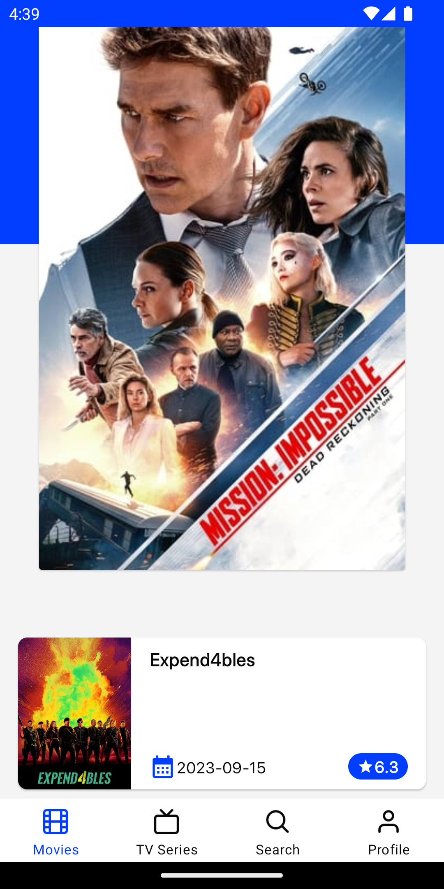
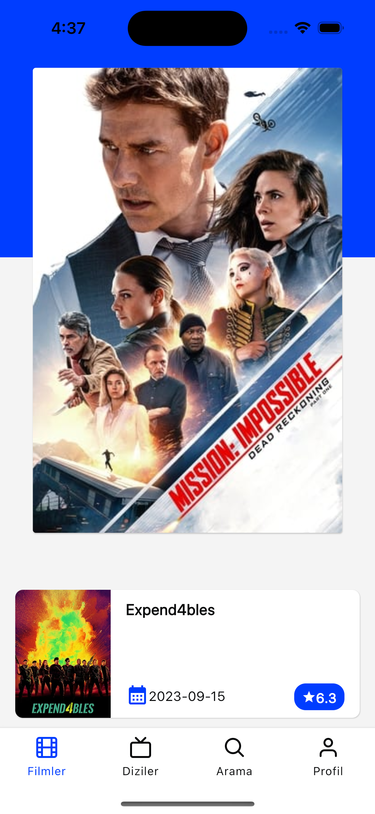

## About Project

This is a TMDB client has been developed within Compose Multiplatform.

### Screenshots
<div align="left">
 
 
</div>

## Development

### Setup Environment
**[Compose Multiplatform Template](https://github.com/JetBrains/compose-multiplatform-ios-android-template#set-up-the-environment):** You can see how to setup environment here

### API Key

To run the application you need to supply an API key from [TMBD](https://developers.themoviedb.org/3/getting-started/introduction). When you get the key please add following variable to your local environment:

`` API_KEY_TMDB = Your API Key ``

How to set an environment variable in [Mac](https://medium.com/@himanshuagarwal1395/setting-up-environment-variables-in-macos-sierra-f5978369b255) / [Windows](https://www.architectryan.com/2018/08/31/how-to-change-environment-variables-on-windows-10/)

## Architecture

- Single Activity
- MVVM Pattern

**View:** Renders UI and delegates user actions to ViewModel

**ViewModel:** Can have simple UI logic but most of the time just gets the data from UseCase

**UseCase:** Contains all business rules and they written in the manner of single responsibility principle

**Repository:** Single source of data. Responsible to get data from one or more data sources

## Tech Stack

#### Dependencies

- **[Voyager](https://github.com/adrielcafe/voyager) :** Consistent navigation between views
- **[Koin](https://insert-koin.io/docs/setup/koin) :** Dependency injector
- **[Coroutines](https://github.com/Kotlin/kotlinx.coroutines) :** Asynchronous programming
- **[Ktor](https://ktor.io/docs/welcome.html) :** Type safe HTTP client
- **[Kotlinx](https://github.com/Kotlin/kotlinx.serialization) :** JSON serializer/deserializer
- **[Moko](https://github.com/icerockdev/moko-resources) :** Resource management
- **[Seiko](https://github.com/qdsfdhvh/compose-imageloader) :** Image loading and caching
- **[Kvault](https://github.com/Liftric/KVault/tree/master) :** Secure key-value storage

## License

```
Copyright 2023 adesso Turkey

Licensed under the Apache License, Version 2.0 (the "License");
you may not use this file except in compliance with the License.
You may obtain a copy of the License at

    http://www.apache.org/licenses/LICENSE-2.0

Unless required by applicable law or agreed to in writing, software
distributed under the License is distributed on an "AS IS" BASIS,
WITHOUT WARRANTIES OR CONDITIONS OF ANY KIND, either express or implied.
See the License for the specific language governing permissions and
limitations under the License.
```
